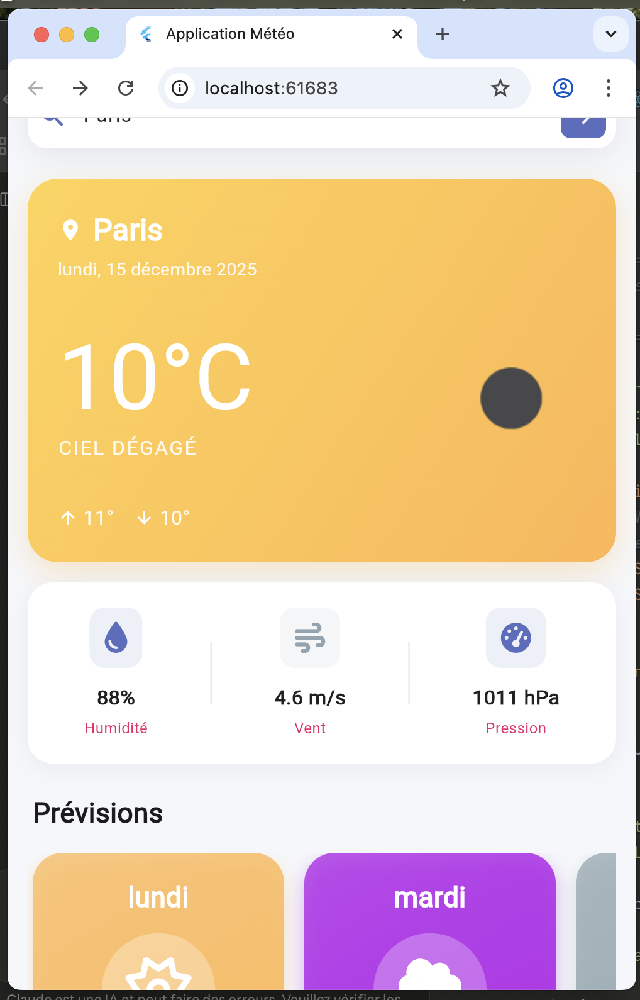
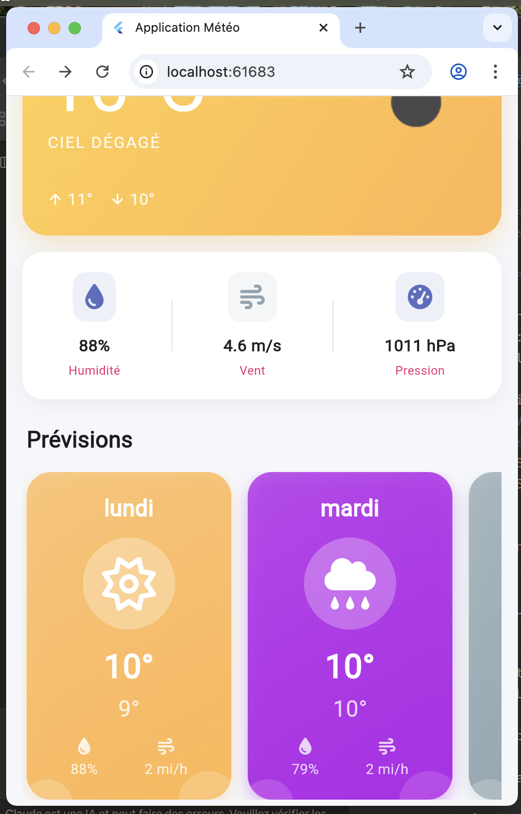
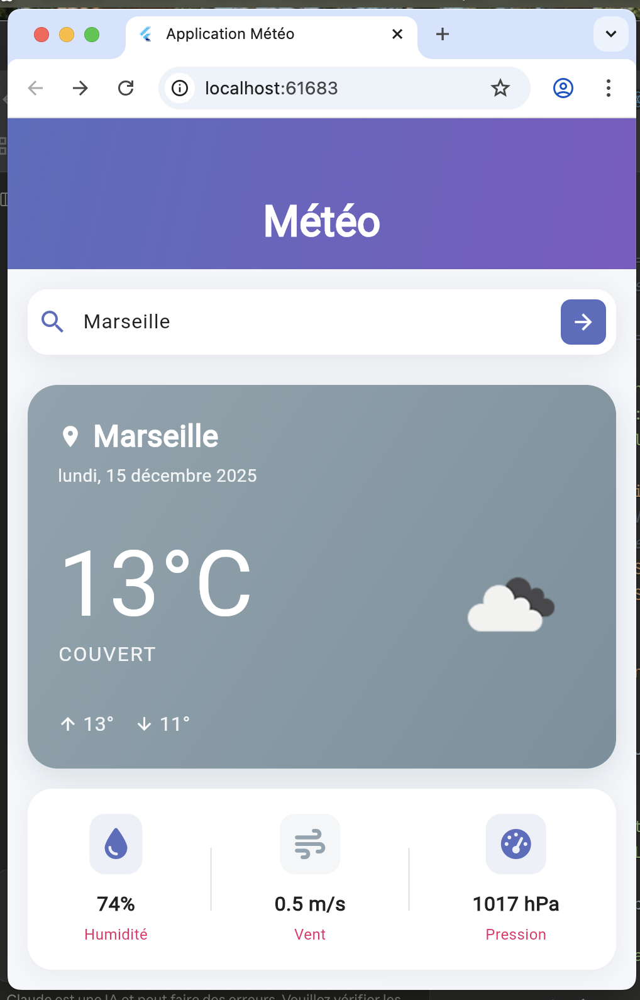
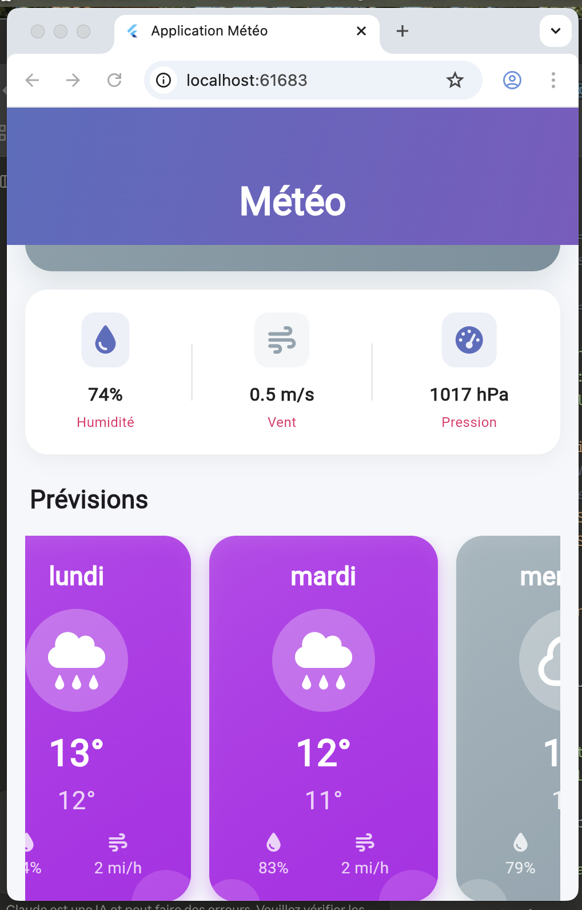
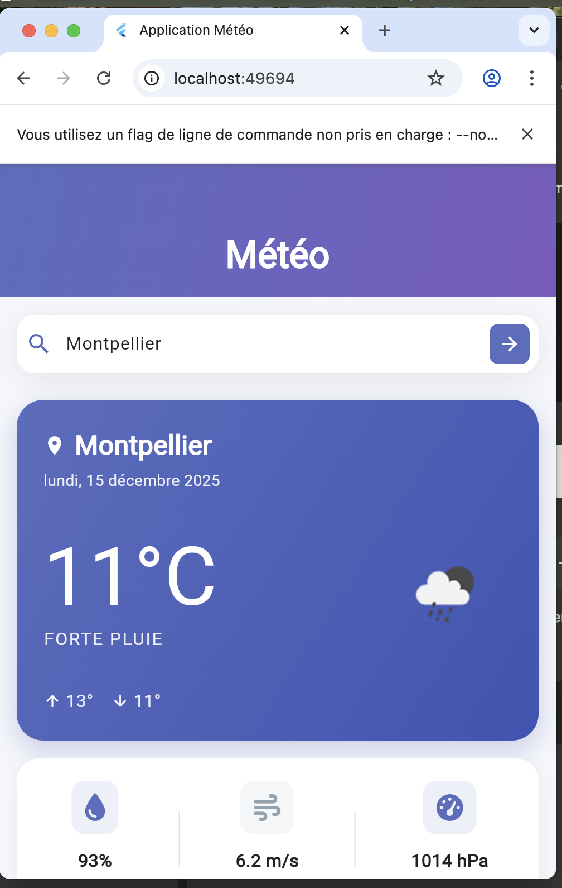
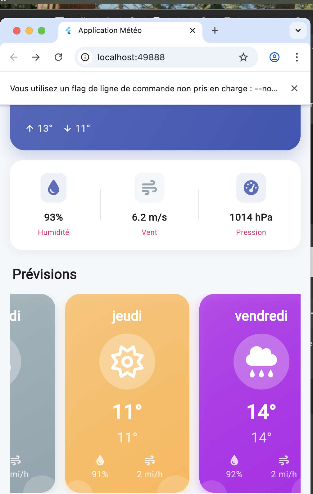

# 🌦️ Application Météo Flutter

## 📱 Vue d'ensemble

Application météo complète développée avec Flutter utilisant l'API OpenWeatherMap. L'application permet de rechercher la météo actuelle et les prévisions sur 5 jours pour n'importe quelle ville dans le monde.

<div style="display: flex; gap: 40px;">
  
  
  
  
  
  
</div>


## ✨ Fonctionnalités

- ✅ Recherche de ville par nom
- ✅ Affichage de la météo actuelle
- ✅ Température, humidité, pression, vent
- ✅ Prévisions sur 5 jours
- ✅ Icônes météo animées
- ✅ Design moderne et responsive
- ✅ Animations et transitions fluides
- ✅ Gestion d'état avec Provider
- ✅ Architecture propre et organisée

## 🏗️ Architecture

```
lib/
├── business_logic/
│   └── providers/
│       └── weather_provider.dart        # Provider pour la météo
├── data/
│   ├── models/
│   │   └── weather_model.dart           # Modèles de données
│   └── services/
│       └── weather_api_service.dart     # Service API
└── presentation/
    ├── constants/
    │   └── app_colors.dart              # Couleurs et styles
    ├── pages/
    │   └── weather_page.dart            # Page principale
    ├── utils/
    │   ├── date_utils.dart              # Utilitaires de date
    │   └── weather_icons.dart           # Icônes météo
    └── widgets/
        ├── current_weather_card.dart                 # Carte météo actuelle
        ├── weather_details_card.dart                 # Détails météo
        ├── previsions_horizontal_list.dart           # Liste prévisions
        ├── previsions_card_horizontal.dart           # card prévisions 
        └── weather_search_field.dart                 # Champ de recherche

```

## 🚀 Installation

### Prérequis

- Flutter SDK (version 3.0 ou supérieure)
- Dart SDK
- Un compte OpenWeatherMap (gratuit)

### Étape 1 : Obtenir une clé API

1. Allez sur [OpenWeatherMap](https://openweathermap.org/api)
2. Créez un compte gratuit
3. Allez dans **API keys**
4. Copiez votre clé API

### Étape 2 : Configuration du projet

1. **Créer le projet**
```bash
flutter create weather_app
cd weather_app
```

2. **Copier les fichiers**
    - Remplacez le dossier `lib/` avec les fichiers fournis
    - Remplacez `pubspec.yaml` avec le fichier fourni

3. **Configurer la clé API**

Ouvrez `lib/data/services/weather_api_service.dart` et remplacez :

```dart
static const String _apiKey = 'VOTRE_CLE_API_ICI';
```

Par votre vraie clé API :

```dart
static const String _apiKey = 'abc123def456...'; // Votre clé
```

4. **Installer les dépendances**
```bash
flutter pub get
```

5. **Lancer l'application**
```bash
flutter run
```

## 📦 Dépendances

```yaml
dependencies:
  provider: ^6.1.1                  # Gestion d'état
  http: ^1.1.0                      # Appels HTTP
  intl: ^0.18.1                     # Formatage dates
  font_awesome_flutter: ^10.6.0     # Icônes
  cached_network_image: ^3.3.0      # Cache images
```

## 🎨 Interface Utilisateur

### 1. Champ de Recherche
```
┌─────────────────────────────┐
│ 🔍 Entrez le nom d'une ville │ ➡️
└─────────────────────────────┘
```

### 2. Carte Météo Actuelle
```
┌─────────────────────────────┐
│ 📍 Paris                     │
│ Mardi, 15 Décembre 2025     │
│                             │
│ 15°C        ☀️              │
│ ENSOLEILLÉ                  │
│                             │
│ ⬆️ 18° ⬇️ 12°              │
└─────────────────────────────┘
```

### 3. Détails Météo
```
┌─────────────────────────────┐
│  💧        🌬️        📊     │
│  75%      5.2 m/s   1013 hPa│
│Humidité    Vent    Pression │
└─────────────────────────────┘
```

### 4. Prévisions 5 Jours
```
┌─────────────────────────────├───────────────────────────────── ┤    
│ Mer.     ☁️  Nuageux  ⬆️18° │  Jeu.     ☀️  Ensoleillé⬆️20°   │
│ 16 Déc.             ⬇️12°   │17 Déc.             ⬇️14°         │
├─────────────────────────────┤───────────────────────────────── ┤

```


## 🔧 Configuration de l'API

### Endpoints utilisés

1. **Météo actuelle**
```
GET https://api.openweathermap.org/data/2.5/weather
?q={city_name}
&appid={API_key}
&units=metric
&lang=fr
```

2. **Prévisions 5 jours**
```
GET https://api.openweathermap.org/data/2.5/forecast
?q={city_name}
&appid={API_key}
&units=metric
&lang=fr
```

### Paramètres
- `q` : Nom de la ville
- `appid` : Votre clé API
- `units=metric` : Températures en Celsius
- `lang=fr` : Descriptions en français

## 💻 Utilisation du Code

### Provider

```dart
// Rechercher la météo
context.read<WeatherProvider>().fetchWeather('Paris');

// Écouter les changements
Consumer<WeatherProvider>(
  builder: (context, weatherProvider, child) {
    if (weatherProvider.isLoading) {
      return CircularProgressIndicator();
    }
    
    if (weatherProvider.hasData) {
      return WeatherDisplay(weather: weatherProvider.currentWeather);
    }
    
    return EmptyState();
  },
)
```

### Modèles de données

```dart
// WeatherModel
final weather = WeatherModel.fromJson(jsonData);
print(weather.temperature);      // 15.5
print(weather.cityName);         // "Paris"
print(weather.weatherDescription); // "ciel dégagé"
print(weather.temperatureCelsius); // "16°C"
```

### Service API

```dart
final apiService = WeatherApiService();

// Obtenir la météo actuelle
final weather = await apiService.getCurrentWeather('Paris');

// Obtenir les prévisions
final forecast = await apiService.getForecast('Paris');

// Obtenir les deux en une fois
final data = await apiService.getWeatherAndForecast('Paris');
```

## 🎨 Personnalisation

### Changer les couleurs

Dans `lib/presentation/constants/app_colors.dart` :

```dart
class AppColors {
  static const Color primary = Color(0xFF5C6BC0);      // Bleu indigo
  static const Color secondary = Color(0xFF7E57C2);    // Violet
  static const Color background = Color(0xFFF5F7FA);   // Gris clair
  
  // Changez ces valeurs pour personnaliser
}
```

### Ajouter des villes favorites

Créez un `FavoriteCitiesProvider` :

```dart
class FavoriteCitiesProvider with ChangeNotifier {
  List<String> _favorites = [];
  
  void addFavorite(String city) {
    if (!_favorites.contains(city)) {
      _favorites.add(city);
      notifyListeners();
    }
  }
  
  List<String> get favorites => _favorites;
}
```

### Ajouter la géolocalisation

Ajoutez `geolocator` dans `pubspec.yaml` :

```yaml
dependencies:
  geolocator: ^10.1.0
```

Puis dans votre service API :

```dart
Future<WeatherModel> getWeatherByLocation(double lat, double lon) async {
  final url = Uri.parse(
    '$_baseUrl/weather?lat=$lat&lon=$lon&appid=$_apiKey&units=metric&lang=fr',
  );
  // ... reste du code
}
```

## 🐛 Résolution de Problèmes

### Erreur : "Invalid API key"

**Cause** : Votre clé API n'est pas valide ou pas encore activée

**Solution** :
1. Vérifiez que vous avez copié la bonne clé depuis OpenWeatherMap
2. Attendez quelques minutes (l'activation peut prendre du temps)
3. Vérifiez que vous avez un plan gratuit actif

### Erreur : "City not found"

**Cause** : Le nom de la ville n'est pas reconnu

**Solution** :
1. Vérifiez l'orthographe
2. Essayez avec le nom en anglais (ex: "Paris" ✅, "Pariss" ❌)
3. Pour les villes avec accents, essayez sans accent

### Images ne s'affichent pas

**Cause** : Problème de cache ou connexion internet

**Solution** :
```dart
// Vider le cache
await DefaultCacheManager().emptyCache();
```

### Erreur de date/heure

**Cause** : Problème d'initialisation Intl

**Solution** : Assurez-vous que dans `main.dart` :
```dart
await initializeDateFormatting('fr_FR', null);
```

## 📊 Structure des Données API

### Réponse météo actuelle

```json
{
  "name": "Paris",
  "main": {
    "temp": 15.5,
    "temp_min": 12.0,
    "temp_max": 18.0,
    "humidity": 75,
    "pressure": 1013
  },
  "weather": [
    {
      "main": "Clear",
      "description": "ciel dégagé",
      "icon": "01d"
    }
  ],
  "wind": {
    "speed": 5.2
  }
}
```

### Réponse prévisions

```json
{
  "list": [
    {
      "dt": 1702648800,
      "main": {
        "temp": 14.5,
        "temp_min": 12.0,
        "temp_max": 16.0,
        "humidity": 70
      },
      "weather": [
        {
          "main": "Clouds",
          "description": "nuageux",
          "icon": "02d"
        }
      ]
    }
  ]
}
```

## 🎓 Concepts Flutter Utilisés

### State Management
- ✅ Provider avec ChangeNotifier
- ✅ Consumer et context.read/watch
- ✅ Gestion des états (loading, loaded, error)

### Architecture
- ✅ Séparation business logic / presentation / data
- ✅ Models, Services, Providers
- ✅ Repository pattern

### UI/UX
- ✅ Custom widgets réutilisables
- ✅ Animations et transitions
- ✅ Responsive design
- ✅ Material Design 3

### Réseau
- ✅ HTTP requests avec package http
- ✅ Parsing JSON
- ✅ Gestion des erreurs
- ✅ Cache d'images

## 📈 Améliorations Possibles

- [ ] Persistance avec SharedPreferences
- [ ] Villes favorites
- [ ] Géolocalisation automatique
- [ ] Graphiques de température
- [ ] Notifications météo
- [ ] Mode sombre
- [ ] Support multilingue
- [ ] Widget home screen
- [ ] Partage sur réseaux sociaux
- [ ] Alertes météo

## 📝 Notes Importantes

1. **Limite API gratuite** : 1000 appels/jour
2. **Temps d'activation** : La clé API peut prendre 2h à s'activer
3. **Cache** : Les images météo sont mises en cache automatiquement
4. **Connexion** : L'app nécessite une connexion internet

## 🎯 Exercice TP2

Cette application remplit tous les critères de l'Exercice 2 du TP2 :

✅ **StatefulWidget** avec gestion d'état  
✅ **TextField** pour la recherche  
✅ **Informations météo** : température, humidité, vent, pression  
✅ **Prévisions** sur 5 jours  
✅ **API OpenWeatherMap** intégrée  
✅ **Modèles de données** avec JSON to Dart  
✅ **Service réseau** encapsulé  
✅ **DateFormat** avec package intl  
✅ **Thèmes et styling** personnalisés  
✅ **Animations** fluides  
✅ **Icônes adaptées** selon la météo

## 📚 Ressources

- [OpenWeatherMap API Docs](https://openweathermap.org/api)
- [Flutter Provider](https://pub.dev/packages/provider)
- [Flutter HTTP](https://pub.dev/packages/http)
- [Intl Package](https://pub.dev/packages/intl)
- [Font Awesome Flutter](https://pub.dev/packages/font_awesome_flutter)


##  Licence

Ce projet est développé à des fins pédagogiques.


---

**Développé avec ❤️ en Flutter**